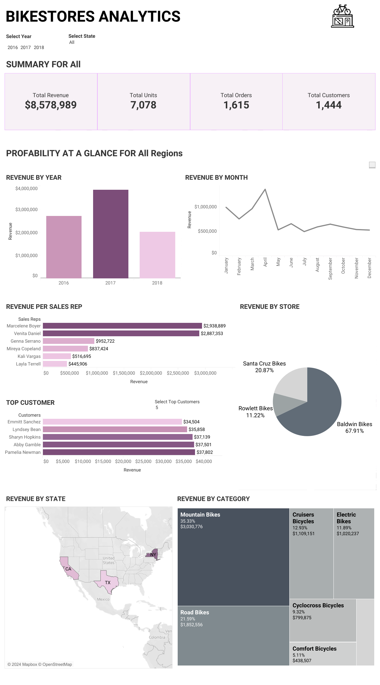
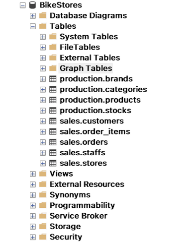
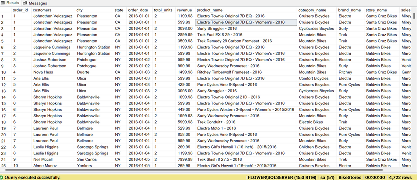
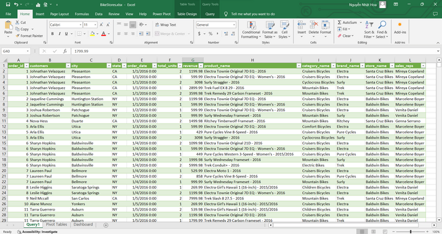
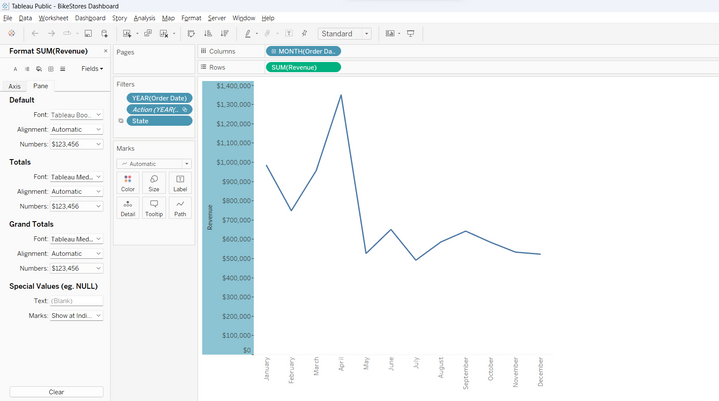

# Data Visualization (Bike Stores Dataset)
[Dashboard](https://public.tableau.com/views/BikeStoresDashboard_16973664425040/Dashboard1?:language=en-US&:display_count=n&:origin=viz_share_link)


## The Summary
### Conclusion
Bike Stores demonstrate a growing revenue trend over the years. The generated charts helped identify important factors such as monthly revenue, state-wise revenue, store-wise revenue, brand-wise revenue, product category-wise revenue, top customers, and revenue per salesperson.
### Challenges
The project encountered challenges in data collection and preparation, handling large datasets, selecting suitable charts, and designing an effective dashboard.
### Techniques
- Microsoft SQL Server was used to query and export the dataset by writing SQL queries
- Tableau, a powerful data visualization tool, was employed to create interactive and informative charts based on the exported dataset.

### Tools Used
- Excel
- SQL Server
- Tableau

### Step by step
#### 1. Collect and Cleaning the data
Use SQL Server to execute the .sql files in the folder.

The result is the BikeStores database.



Use SQL to create a query to retrieve data from the Main.sql file.

```
SELECT 
	ord.order_id,
	CONCAT(cus.first_name,' ',cus.last_name) as 'customers',  
	cus.city,
	cus.state,
	ord.order_date,
	SUM(ite.quantity) AS 'total_units',
	SUM(ite.quantity * ite.list_price) AS 'revenue',
	pro.product_name,
	cat.category_name,
	bra.brand_name,
	sto.store_name,
	CONCAT(sta.first_name,' ', sta.last_name) AS 'sales_reps'
FROM sales.orders ord
JOIN sales.customers cus
ON cus.customer_id = ord.customer_id
JOIN sales.order_items ite
ON ite.order_id = ord.order_id
JOIN production.products pro
ON pro.product_id = ite.product_id
JOIN production.categories cat
ON cat.category_id = pro.category_id
JOIN sales.stores sto
ON sto.store_id = ord.store_id
JOIN sales.staffs sta
ON sta.staff_id = ord.staff_id
JOIN production.brands bra
ON bra.brand_id = pro.brand_id
GROUP BY 
	ord.order_id,
	CONCAT(cus.first_name,' ',cus.last_name),  
	cus.city,
	cus.state,
	ord.order_date,
	pro.product_name,
	cat.category_name,
	bra.brand_name,
	sto.store_name,
	CONCAT(sta.first_name,' ', sta.last_name)
```

Results:



Create an Excel file named 'BikeStores'. Copy the data from the query result in Main.sql and paste it into the BikeStores file. Verify that the data columns have been cleaned.



#### 2. Data Analysis and Visualization

Import the BikeStores.xlsx Excel file into Tableau.

Create worksheets with charts, adjust the formatting to display chart names and monetary values in US dollars



Create a dashboard and add the worksheets to it, linking filters to the charts.

Complete the dashboard and upload it to the website.

Press [Dashboard](https://public.tableau.com/views/BikeStoresDashboard_16973664425040/Dashboard1?:language=en-US&:display_count=n&:origin=viz_share_link) to view.